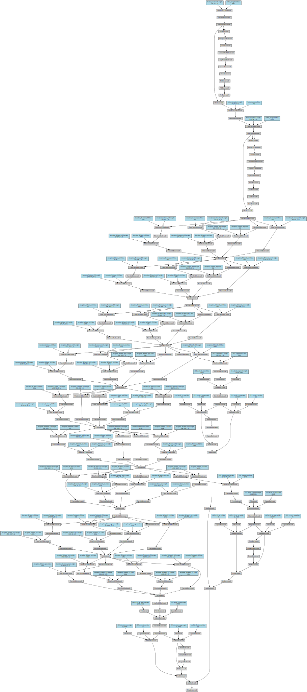

```python
import torch
from posenet import PoseNet
from torchviz import make_dot

model = PoseNet(input_nc = 3)
x = torch.randn(1, 3, 224, 224)
output = model(x)
make_dot(output.mean(), params = dict(model.named_parameters()))
```





